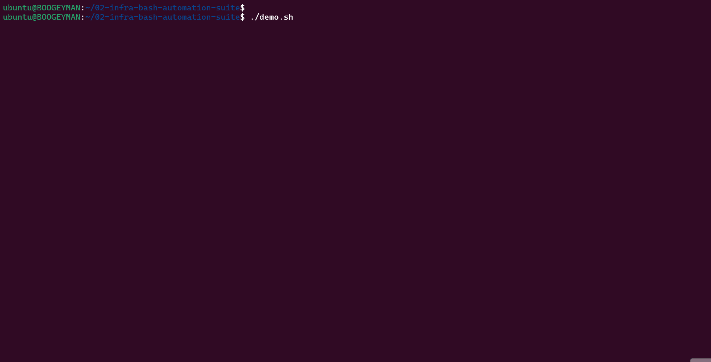

## Bash automation-siute
This repository provides a comprehensive suite of production-ready Bash automation scripts designed to support and automate enterprise-grade DevOps operations. 


---

##  Executive Summary

The **Bash Automation Toolkit for DevOps Engineers** is a production-ready collection of Linux/Bash automation scripts designed and structured to reflect **real-world enterprise DevOps environments**.

This repository demonstrates how Bash is treated as a **first-class engineering asset**, governed by CI/CD, static analysis, containerization, cloud bootstrap automation, monitoring integration, and operational best practices.

> This project mirrors high-maturity corporate standards by treating automation as a governed product through CI/CD, linting, and modular engineering. 

---


##  Infrastructure & CI/CD Highlights
**Status:** `STABLE` | **Coverage:** `100% Syntax & Linted` | **CI Tooling:** `Jenkins, ShellCheck`

This repository demonstrates high-quality Bash automation backed by a declarative CI/CD pipeline.
* **Production-Ready Validation:** Every commit undergoes automated **Bash Syntax Checking** and **ShellCheck** linting.
* **Automated Testing:** Integrated test suite verifies system health logic and monitoring thresholds.
* **Infrastructure as Code:** Managed via a `Jenkinsfile` for automated environment setup and permission handling.

| Capability | Proof of Implementation |
| :--- | :--- |
| **CI/CD Pipeline** | [View Declarative Jenkinsfile](./Jenkinsfile) |
| **Automated Tests** | [View Test Suite](./tests/) |
| **Linting Standards** | Build logs verified with ShellCheck 0.9.0 |

<details>
<summary><b>📺 Click to see a live demo of the scripts in action</b></summary>


</details>

---

##  What This Project Demonstrates

- Enterprise-grade Bash scripting standards  
- CI/CD enforcement using Jenkins  
- Static analysis with ShellCheck  
- Dockerized execution environments  
- Prometheus-compatible system metrics  
- EC2 Day-0 bootstrap automation via cloud-init  
- Cron-based operational automation  
- Clean repository governance and onboarding clarity  

---

##  Repository Structure

```text
02-bash-automation-toolkit/
│
├── scripts/                # Production automation scripts
│   ├── cleanup_logs.sh
│   ├── system_health.sh
│   ├── system_health_metrics.sh
│   ├── backup_directory.sh
│   ├── user_management.sh
│   ├── install_packages.sh
│   └── service_status.sh
│
├── tests/                  # CI-executed validation tests
│   └── test_system_health.sh
│
├── examples/               # Operational and bootstrap examples
│   ├── crontab_example.txt
│   └── cloud-init.yaml
│
├── Dockerfile              # Containerized execution environment
├── docker-compose.yml      # Local CI runner
├── Jenkinsfile             # Enterprise CI pipeline
├── README.md               # Project documentation
└── .gitignore
```
#  Design Principles (Enterprise Standards)
All scripts in this repository follow these principles:

* **Single Responsibility** – One task per script
* **Idempotency** – Safe to re-run where applicable
* **Fail Fast** – Immediate exit on error
* **No Hard-Coded Environments**
* **Readable, Auditable Output**
* **CI-Enforced Quality Gates**

This mirrors how automation is governed in regulated or large-scale organizations.

---

#  Script Overview & Usage

### 1️⃣ System Health Report
**File:** `scripts/system_health.sh`  
Produces a human-readable system status report.

```bash
./scripts/system_health.sh
```
# Use Cases
* On-call diagnostics
* Cron-based system reporting
* Incident response and triage

---

### 2️⃣ Prometheus Metrics Exporter
File: scripts/system_health_metrics.sh
Exports system metrics in Prometheus exposition format.
```bash
./scripts/system_health_metrics.sh
```
# Metrics Exposed
* CPU load
* Memory usage percentage
* Disk usage percentage
* Designed to be scraped by the node_exporter textfile collector or custom Prometheus jobs.
---
### 3️⃣ Log Cleanup Automation
File: scripts/cleanup_logs.sh
Deletes old log files to prevent disk exhaustion.
```bash
sudo ./scripts/cleanup_logs.sh
```
# Enterprise Use
* Disk hygiene enforcement
* Cron-based log lifecycle management
---
### 4️⃣ Directory Backup Utility
File: scripts/backup_directory.sh
Creates timestamped compressed backups.
```bash
./scripts/backup_directory.sh /var/www
```
# Used in:
* Backup automation
* Disaster recovery preparation
* Lightweight snapshot strategies
---
### 5️⃣ User Management Automation
File: scripts/user_management.sh
```bash
sudo ./scripts/user_management.sh create devuser
sudo ./scripts/user_management.sh delete devuser

```
# Used in:
* Lab environments
* Host bootstrap workflows
* Controlled system provisioning
---
### 6️⃣ Package Installation Bootstrap
File: scripts/install_packages.sh
```bash
sudo ./scripts/install_packages.sh
```
# Installs baseline tooling required on fresh Linux hosts.
---
### 7️⃣ Service Status Checker
File: scripts/service_status.sh
```bash
./scripts/service_status.sh docker
```
# Useful during:
* Incident triage
* CI/CD validation steps
* Service readiness checks
---
###  Testing Strategy
# Test Coverage
* Output validation
* Script execution sanity checks
# Run Tests Manually
```bash
chmod +x tests/test_system_health.sh
tests/test_system_health.sh
```
---
### CI Enforcement
* All tests are mandatory and automatically executed in Jenkins.
* A failure immediately blocks the pipeline.
# CI/CD Pipeline (Jenkins)
> The Jenkins pipeline enforces enterprise-grade quality gates:
1. **Source code checkout**
2. **Bash syntax validation (bash -n)**
3. **ShellCheck static analysis**
4. **Permission verification**
5. **Automated test execution**
---

### Dockerized Execution
# Build and Run
```bash
docker-compose run runner
```
# Why Docker?
* Reproducible execution
* CI parity with Jenkins
* No host pollution
* Consistent developer experience
---
### Cloud Bootstrap (EC2)
# The provided cloud-init.yaml demonstrates Day-0 automation.
* Git is installed
* Repository is cloned
* Script permissions are applied
* Health checks execute automatically
> This simulates real infrastructure bootstrap workflows used in cloud environments.

### Cron Automation Examples
```bash
docker-compose run runner
```
# Used in:
* Operations teams
* Legacy environments
* Lightweight infrastructure setups
---

### Onboarding Guide for New Engineers
1. **Clone the repository**
2. **Review `/scripts` to understand responsibilities**
3. **Execute scripts manually in a sandbox**
4. **Inspect `Jenkinsfile` to learn quality gates**
5. **Use Docker for local validation**
6. **Never bypass CI checks**
7. **Extend scripts following established patterns**

---

## 📄 License & Attribution

**Project Type:** Internal-use   
**Purpose:** Designed for education, demonstration, and showcasing enterprise-grade DevOps practices.

**Author:** [Jonathan Tambe](https://github.com/tambe-jonathan)  
**Target Role:** Senior DevOps / Cloud Engineer

---

> **Note:** This project demonstrates engineering excellence in Bash automation and CI/CD governance. For inquiries or collaboration, feel free to reach out via GitHub.
